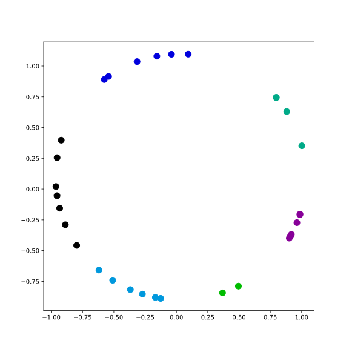
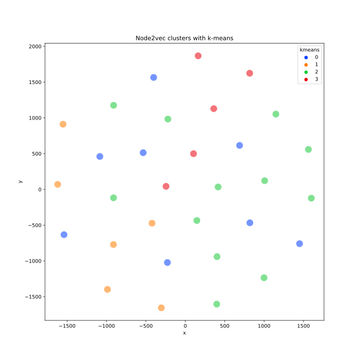

# Spectral Clustering of US Railway Crossing Accidents

Graph mining and spectral clustering over every reported highway-rail grade
crossing accident in the United States, to find which railroad companies share
accident patterns and which places concentrate risk.

Work done during a **Data Science Research Experience for Undergraduates (REU)
at the University of California, Riverside**, summer 2023. The analysis became a
paper at the **ASME/IEEE Joint Rail Conference 2024**.

> **Spectral Clustering in Railway Crossing Accidents Analysis**
> Ethan Villalobos, **Hector Lugo III**, Biqian Cheng, Miguel Gutierrez,
> Constantine Tarawneh, Ping Xu, Jia Chen, Evangelos E. Papalexakis
> *Proceedings of the 2024 Joint Rail Conference*, Columbia, South Carolina,
> May 13–15, 2024. Paper No. V001T05A011. ASME.
>
> 📄 **[Read the paper (free full text — ScholarWorks @ UTRGV)](https://scholarworks.utrgv.edu/me_fac/354/)**
> · [ASME Digital Collection](https://asmedigitalcollection.asme.org/JRC/proceedings/JRC2024/87776/V001T05A011/1201052)

This repository holds **my portion** of that team project: building the company
graphs from the raw accident records and running the clustering over them.

---

## The idea

Grade crossing accidents are usually studied one record at a time — this
crossing, this weather, this year. That framing misses the structure *between*
operators.

So instead: treat each **railroad company as a node**, and connect two companies
when they show up in the same place under the same conditions. The result is a
graph of *implicit* relationships nobody recorded directly — companies are never
listed as related in the data, but the accident record ties them together
through the territory and conditions they share. Clustering that graph groups
companies by accident behaviour rather than by size or geography.

The dataset is [FRA Form 6180.57](https://data.transportation.gov/Railroads/Highway-Rail-Grade-Crossing-Accident-Data/7wn6-i5b9),
the federally mandated report filed for every impact between rail equipment and
a highway user at a crossing.

**The paper's headline result:** `Highway User Position` and `Equipment Involved`
drive the clustering, while temporal attributes like `Date` and `Time` matter far
less than intuition suggests — *where* and *what*, not *when*.

## Results

Two independent embeddings of the same company graph, each clustered with
k-means. They agree that the companies separate into a handful of coherent
groups, which is the point — the structure is a property of the graph, not of
one particular embedding.

| Spectral embedding | node2vec embedding |
| :---: | :---: |
|  |  |
| Normalized Laplacian → 2 smallest eigenvectors → k-means, with *k* chosen by silhouette score, projected with PCA | 64-d node2vec random-walk embeddings → k-means (*k*=4), projected with t-SNE |

Both run over the same 31 companies and the same county-sharing relation,
weighted by vehicle damage cost.

## Method

The scripts form a pipeline, from raw records to clusters:

**1 — Look at the raw signal.** Accident volume by year, and by weather
condition. Establishes the base rates everything downstream is read against.

**2 — Build company graphs.** Several *views* of the same set of companies, each
encoding a different notion of "related":

| View | Edge means | Edge weight |
| --- | --- | --- |
| County-year | both companies reported accidents in the same county in the same year | unweighted |
| Weather-year | both reported accidents under the same weather condition in the same year | unweighted |
| Damage cost | both operate in a shared county | accumulated vehicle damage cost across shared counties |
| Casualties | both operate in a shared county | total killed + injured across both FRA reporting forms |
| Bipartite | a company reported an accident in a county | unweighted, companies and counties as separate node types |

Multiple views of one node set is what makes this a *multi-view* graph problem:
each view is a partial, noisy signal about the same underlying relationships.

**3 — Rank.** PageRank over a directed accident → company graph, so a company's
importance reflects the accidents flowing into it rather than a raw count.

**4 — Cluster.** Two independent approaches on the damage-cost graph:

- **Spectral** — normalized Laplacian, its two smallest eigenvectors, k-means
  across *k* = 2…10 with the best silhouette score winning.
- **node2vec** — biased random walks producing 64-d embeddings, k-means at
  *k* = 4, visualized with t-SNE.

## Repository layout

```
├── data/            # dataset lives here (not committed) — see data/README.md
├── figures/         # generated result plots
├── src/
│   ├── config.py            # resolves the dataset path
│   ├── eda/                 # stage 1 — raw signal
│   ├── graph/               # stages 2 & 3 — graph construction and ranking
│   └── clustering/          # stage 4 — clustering
├── requirements.txt
└── LICENSE
```

| Script | Stage | What it produces |
| --- | --- | --- |
| `src/eda/accidents_by_year.py` | 1 | Accidents per year bar chart; county-year company graph, spectrally split in two |
| `src/eda/accidents_by_weather.py` | 1 | Accidents per weather condition; weather-year company graph, spectrally split in two |
| `src/graph/multiview_graph.py` | 2 | Bipartite company↔county graph drawn on two axes of a 3D plot |
| `src/graph/damage_cost_graph.py` | 2 | Company graph weighted by shared vehicle damage cost, with edge labels |
| `src/graph/casualty_graph.py` | 2 | Company graph with nodes labelled by total casualties |
| `src/graph/pagerank_companies.py` | 3 | PageRank per company, plus accident counts over time |
| `src/clustering/spectral_kmeans.py` | 4 | `figures/kmeans_spectral_clustering.svg` + silhouette sweep |
| `src/clustering/node2vec_kmeans.py` | 4 | `figures/kmeans_node2vec.svg` + cluster assignments |

## Running it

**Requires Python 3.11 or 3.12.** `numpy` is pinned below 2.0 because gensim,
which node2vec depends on, requires it — and numpy 1.x publishes no wheels for
Python 3.13+, so installing there falls back to a source build and fails.

```bash
git clone https://github.com/Wavy-Hec/summer-REU-project.git
cd summer-REU-project

python -m venv venv && source venv/bin/activate      # Windows: venv\Scripts\activate
pip install -r requirements.txt
```

Download the dataset into `data/` — see **[data/README.md](data/README.md)** for
the link and the exact filename. Then run any script directly:

```bash
python src/eda/accidents_by_year.py
python src/clustering/spectral_kmeans.py
```

Each script opens its plots in a window. The two clustering scripts also write
their SVGs into `figures/`, overwriting what is committed there.

Scripts resolve the dataset through `src/config.py`, which checks
`$REU_DATA_PATH` first and otherwise looks in `data/`. Nothing is hardcoded to a
machine.

Tested on Python 3.11 with the resolved versions noted in `requirements.txt`.

## Notes on the code

This is 2023 research code. Bringing it up to the current scientific Python
stack needed six fixes, all of them library API changes rather than changes to
the analysis:

- `nx.to_scipy_sparse_matrix` was renamed in networkx 2.7 and removed in 3.0 →
  `nx.to_scipy_sparse_array`.
- scikit-learn refuses sparse input with 64-bit indices, which is what networkx
  returns on 64-bit builds → the two EDA scripts densify to float first.
- `TSNE(n_iter=…)` was renamed in scikit-learn 1.5 and removed in 1.7 →
  `max_iter`.
- `spectral_kmeans.py` had its entire edge-building loop commented out, so it was
  decomposing an all-zero adjacency matrix. Restored.
- The same script fed a *directed* graph to `csgraph.laplacian(normed=True)` and
  `eigsh`, both of which assume symmetry → the graph is symmetrized first.
- `multiview_graph.py` built node positions by indexing the dataframe with node
  IDs, which addresses the wrong axis. Node IDs are now namespaced (`RR:` /
  `CO:`) so a company index and a county code cannot silently collide, and
  positions come from explicit coordinate maps.

`accidents_by_year.py` also computed cluster labels and then never drew them;
it now plots the clustered graph.

### Known limitations

Carried over from the original analysis, left in place so results stay
reproducible:

- `pagerank_companies.py` averages PageRank over every node whose ID *starts
  with* a company code, so companies whose codes are prefixes of one another
  share a score.
- `casualty_graph.py` labels nodes with a casualty count, so one company appears
  as several nodes across counties while edges only ever attach to the first —
  leaving isolated nodes in the drawing.
- Both clustering scripts take the first 31 companies rather than sampling, and
  their edge construction is O(n²) over grouped rows.

## Citation

```bibtex
@inproceedings{villalobos2024spectral,
  author    = {Villalobos, Ethan and Lugo III, Hector and Cheng, Biqian and
               Gutierrez, Miguel and Tarawneh, Constantine and Xu, Ping and
               Chen, Jia and Papalexakis, Evangelos E.},
  title     = {Spectral Clustering in Railway Crossing Accidents Analysis},
  booktitle = {Proceedings of the 2024 Joint Rail Conference},
  year      = {2024},
  month     = may,
  address   = {Columbia, South Carolina, USA},
  publisher = {American Society of Mechanical Engineers},
  note      = {Paper No. V001T05A011},
  url       = {https://asmedigitalcollection.asme.org/JRC/proceedings/JRC2024/87776/V001T05A011/1201052}
}
```

## Credits

Research conducted at UC Riverside as part of an NSF-funded REU, in collaboration
with the University of Texas Rio Grande Valley. Repository created by
[Ethan Villalobos](https://github.com/ethanvillalobos8); the code here is the
portion contributed by [Hector Lugo III](https://github.com/Wavy-Hec).

Released under the [MIT License](LICENSE).
